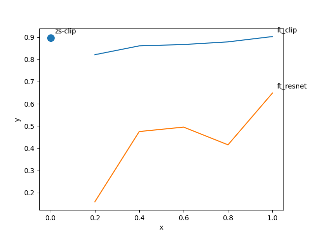

FSL
==============================

## Few-shot learning takehome assignment

### Few-shot
The few shot implementation used here is a simple classification head similar to the linear probe discussed in the CLIP paper.
Due to the low regimen data little effort is put into to this classification head, the same holds for data autgmentation and preprocessing (normalization-wise).
We finetune a simple resnet50 to act as a baseline.
We confront this baseline with 2 of the CLIP model family (one with the resnet50 backbone, another with the ViT backbone).

PS: A more traditionnal FSL/meta learning was started for little results due to computing power.
### Zero-shot
For the zero-shot transfer, we follow the logic proposed in the paper.
A simple OOD detection is proposed leveraging the same zero-shot approach.

PS: Our initial idea was to use/train an image descriptor but the simple approach discussed above provided decent results.

### Results
The below figure provides a way to appreciate some of the results. Tensorboards logs are provided for transparency.

### Project Organization
The project layout is adapted from <a target="_blank" href="https://drivendata.github.io/cookiecutter-data-science/">cookiecutter data science project template.

--------

    ├── LICENSE
    ├── README.md          <- The top-level README for developers using this project.
    ├── data               <- FSL and ZSL data as dowloaded from the assignment
    ├── models             <- Trained and serialized models, model predictions, or model summaries
    ├── notebooks          <- Jupyter notebooks.
    ├── reports            <- Generated analysis as HTML, PDF, LaTeX, etc.
    │   └── figures        <- Generated graphics and figures to be used in reporting
    ├── requirements.txt   <- The requirements file for reproducing the analysis environment, e.g.
    │                         generated with `pip freeze > requirements.txt`
    └── src                <- Source code used in this project.
--------
